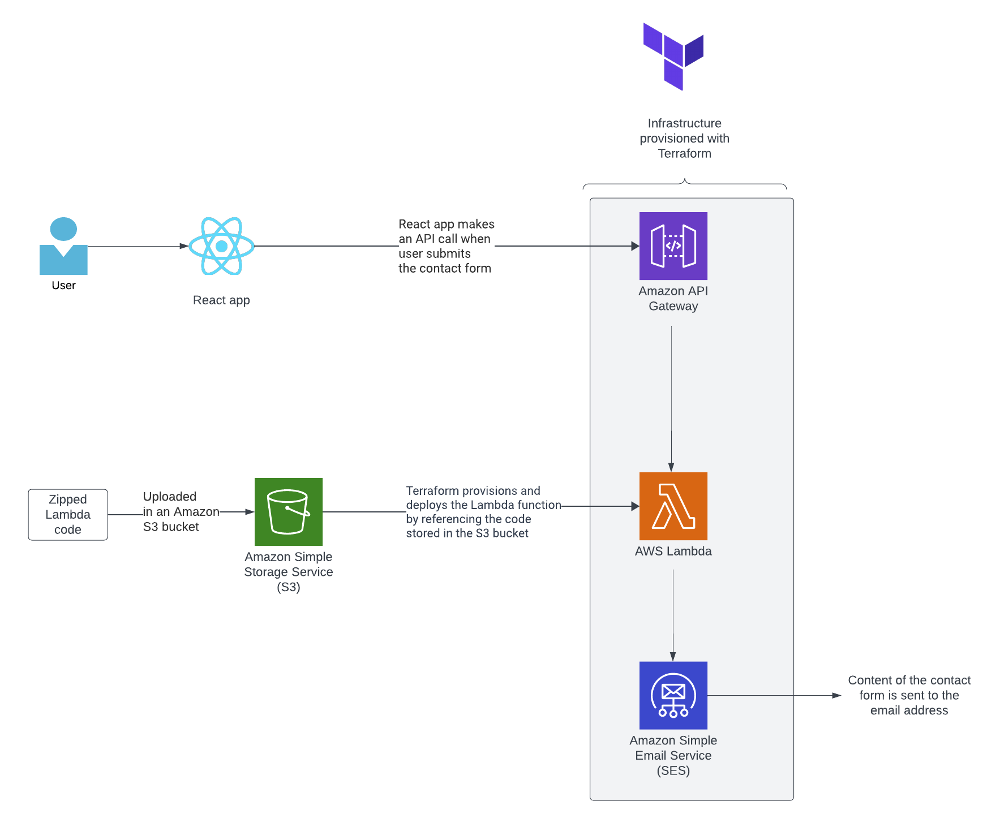
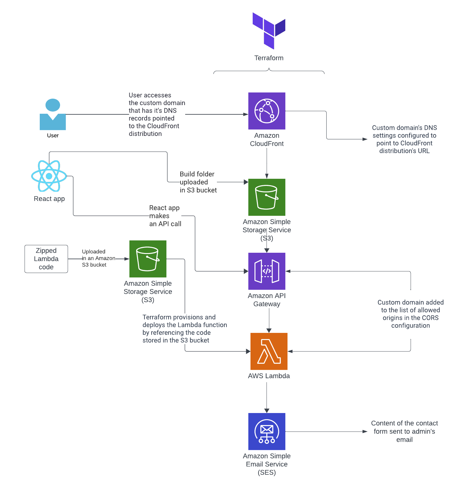

# Serverless contact form utilizing AWS and Terraform

This repository hosts a simple frontend web application with a contact form, designed to run on AWS's serverless architecture. It leverages Amazon Simple Email Service, AWS Lambda, API Gateway, S3 and CloudFront. The infrastructure is provisioned and managed using Terraform, allowing you to easily deploy and maintain your serverless contact form app on AWS.

I have created a tutorial for this project on my [blog](https://blog.marikabergman.com/react-aws-terraform-tutorial-deploying-a-serverless-contact-form). In this tutorial the 
frontend application is run locally and it will be connected to a serverless AWS backend.
The architecture for this is desribed in the below diagram:

This repository also contains code to deploy the frontend application to AWS S3 and CloudFront
and connect it to a custom domain. This architecture is described in the below diagram:

## Frontend

The frontend application has been created with React and Mantine UI. It could be easily extended to have other pages in addition to the contact form. The frontend can be found in the ``frontend-react`` -directory.

## Serverless backend

The contact form utilizes a serverless backend. The data from the contact form is sent to an API Gateway, which then directs it to a Lambda function. The Lambda function leverages Amazon Simple Email Service to forward the contents of the contact form to the chosen email address.

### Terraform modules

The ``main.tf`` -file contains three modules. There is a module for creating the frontend resources (S3, CloudFront) and another for creating the serverless backend resources (API Gateway, Lambda). The third module is for enabeling CORS for the API Gateway. 

## API Gateway resource

To use the API Gateway with a custom domain, you need to change the origin address in the ``main.tf`` cord module to your custom domain.

On the ``resource-api_gateway` add your custom domain in 'aliases'.

You need to have an SSL/TLS certificate to enable HTTPS for your custom domain. This can be done with an AWS ACM Certificate, which is not included in the code but can be done manually through the AWS console. Add the certificate id to the ``resource-api_gateway``

### Lambda resource

The Lambda code can be found in the ``aws-lambda`` -directory. For this code to work, you have to do the following changes:
- change the region to your preferred region
- add your custom domain to 'Access-Control-Allow-Origin'
- change to - and source -addresses accordingly

Please note the email addresses have to be added and approved via the AWS SES console for the SES to use them.

## Set up

To run this project, you need to install AWS CLI and Terraform.

## Deployment

To deploy the application, the following steps have to be completed in order. Please note, that the below instructions work only if your application is deployed on a custom domain. For other kinds of setups, such as using CloudFront URL, the CORS settings and order of deployment would have to be modified. Alternatively, you can run the React application locally and leave the CORS settings to default.

1. Create an S3 bucket either in the AWS console or using AWS CLI. Upload the zipped Lambda code into the S3 bucket either using the AWS console or AWS CLI. The name of this S3 bucket has to be referred to on the Lambda resource code. 
2. Create a workspace on Terraform cloud and add the workspace name together with your organization name to ``main.tf``. Run ``terraform apply`` to deploy the resources. This will create for you an S3 bucket, CloudFront distribution, API Gateway and Lambda.
3. Add the URL of the AWS API Gateway to the React app's contact-form component. Build the React app with the command ``npm run build``. The contents of the build folder have to be uploaded to the new S3 bucket that Terraform has created either using the AWS console or AWS CLI. 
4. If using a custom domain, change the DNS settings of your custom domain to point to the CloudFront distribution.
